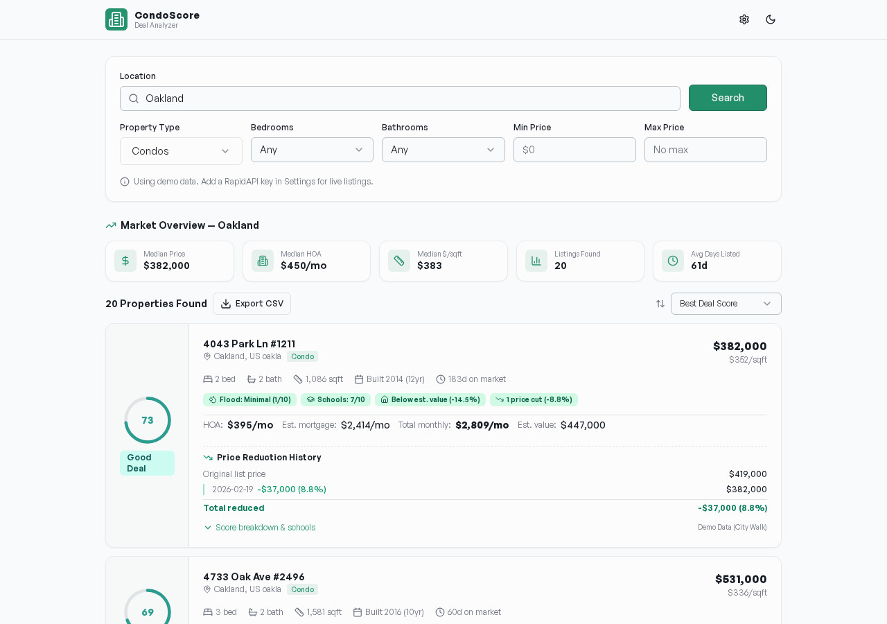
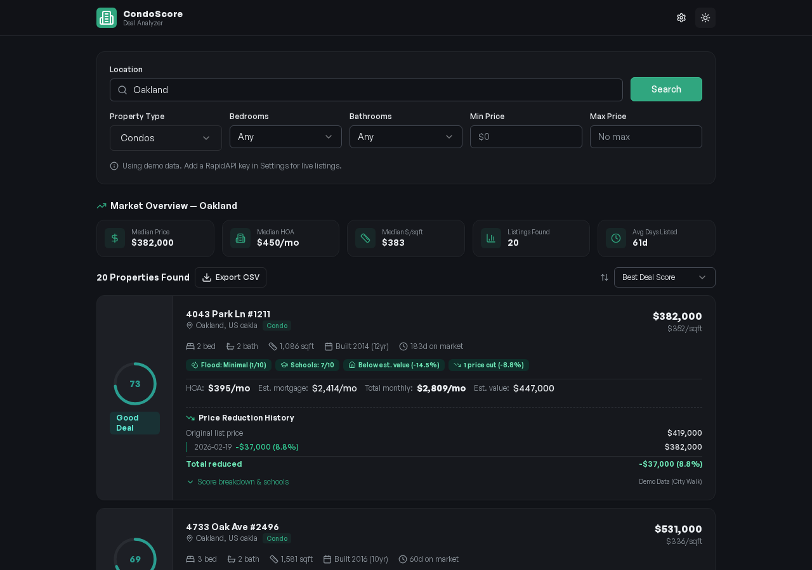

# CondoScore — Deal Analyzer

A 9-dimension scoring tool that helps buyers find the best condo deals. Search any U.S. market and get instant deal scores based on HOA burden, value gap, school quality, flood risk, and more.

## Screenshots

### Light Mode


### Dark Mode


## Features

- **9-Dimension Scoring** — Every listing scored 0–100 across HOA burden, price/sqft, total cost, value gap, school quality, building age, days on market, flood risk, and assessment risk
- **Market Overview** — Median price, HOA, price/sqft, and days listed for your search area
- **Price Reduction History** — See every price cut with dates, amounts, and total reduction percentage
- **Score Breakdowns** — Expand any listing to see exactly how each dimension contributed to the score
- **School Ratings** — GreatSchools ratings with individual school details
- **Flood Risk** — FEMA zone and flood factor scores
- **Export to CSV** — One-click download of all listing data
- **Dark Mode** — Full light/dark theme support
- **Responsive Design** — Works on desktop, tablet, and mobile

## Score Labels

| Score | Label |
|-------|-------|
| 80+ | Great Deal |
| 65–79 | Good Deal |
| 45–64 | Fair |
| 30–44 | Overpriced |
| < 30 | Avoid |

## One-Click Deploy

### Deploy to Railway

[](https://railway.com/template/new?repo=bbuxton0823/condoscore)

### Deploy to Render

[](https://render.com/deploy?repo=https://github.com/bbuxton0823/condoscore)

## Quick Start

### Prerequisites

- [Node.js](https://nodejs.org/) 18 or higher
- npm (comes with Node.js)

### Install & Run

```bash
# Clone the repo
git clone https://github.com/bbuxton0823/condoscore.git
cd condoscore

# Install dependencies
npm install

# Start the development server
npm run dev
```

The app will be running at **http://localhost:5000**.

### Production Build

```bash
# Build for production
npm run build

# Run the production server
NODE_ENV=production node dist/index.cjs
```

## API Key Setup (Optional)

By default, CondoScore runs with demo data so you can explore the interface immediately.

To search real listings, add a [RapidAPI](https://rapidapi.com/apidojo/api/realty-in-us) key for the **Realty in US** API:

1. Click the **⚙ Settings** icon in the top-right corner
2. Enter your RapidAPI key
3. Click **Save**

## Tech Stack

- **Frontend** — React, Tailwind CSS, shadcn/ui
- **Backend** — Express.js
- **Build** — Vite
- **Language** — TypeScript

## Project Structure

```
condo-scorer/
├── client/src/
│   ├── pages/home.tsx      # Main app page with search, results, scoring
│   ├── components/ui/      # shadcn/ui components
│   └── lib/                # Query client, utilities
├── server/
│   ├── routes.ts           # API endpoints (search, export, demo)
│   └── storage.ts          # Storage interface
├── shared/
│   └── schema.ts           # TypeScript types and Zod schemas
└── screenshots/            # App screenshots
```

## License

MIT
